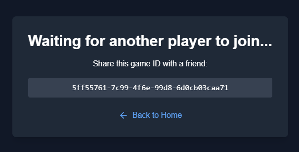

# Accessible Toes

[Try it out here!](https://accessibletoe-a6ubjoo4g-wenjebs-projects.vercel.app/)

Accessible Toes is a feature-rich TicTacToe game built with Next.js, Supabase, and Tailwind CSS. This application allows users to create and join games, view active games, and enjoy real-time gameplay with enhanced accessibility features to make the game enjoyable for all users.

## Table of Contents

- [Tech Stack](#tech-stack)
- [Features](#features)
- [Installation](#installation)
- [Usage](#usage)
- [Contributing](#contributing)
- [License](#license)

## Tech Stack

- **Next.js**: A React framework for building fast and user-friendly web applications.
- **Supabase**: Real-time databases and authentication.
- **Framer Motion**: A production-ready motion library.
- **Web Speech API**: Enables voice synthesis for accessibility features.
- **Vercel**: Deployment platform

## Features

- **Create Games**: Users can create new TicTacToe games with unique IDs.
- **Join Games**: Users can join existing active games.
- **Real-Time Updates**: Live game state updates using Supabase real-time subscriptions.
- **Responsive Design**: Mobile-friendly interface built with Tailwind CSS.
- **Accessible Design**: Adheres to WCAG 2.1 Level AA standards for digital accessibility.
- **Voice Notifications**: Voice announcements when a player joins the game and when moves are made.
- **Game History**: View and manage your active and past games.
- **Enhanced Animations**: Smooth animations with support for reduced motion preferences.

## Usage

### Create a New Game ( Use two incognito browsers to test out multiplayer function )

- **Click on the "Create Game" button** to start a new TicTacToe game.
- **You will be redirected** to the game page with a unique game ID.

### Join an Active Game

- **Visit the "View Other Games" page** to see a list of available games.
- **Click on a game ID** to join and start playing.

### Play the Game

- **Take turns placing Xs and Os** on the game board.
- **The game updates in real-time**, reflecting each player's moves.
- **Voice notifications** will announce when a player joins and each move made.

### View Your Games

- **Access the "View Your Active Games" page** to see all the games you are participating in.

## Installation on local machines

### Prerequisites

- **Node.js**: Ensure you have Node.js installed. You can download it from [here](https://nodejs.org/).
- **Git**: Git should be installed to clone the repository. Download it from [here](https://git-scm.com/).

### Steps

1. **Clone the Repository**

```bash
git clone https://github.com/your-username/accessible-toes.git
cd accessible-toes
```

1. **Install dependencies**

```bash
npm install
or
yarn install
```

3. **Setup environment variables**
   Create a .env.local file in the root directory and add your Supabase credentials:

```bash
NEXT_PUBLIC_SUPABASE_URL=your-supabase-url
NEXT_PUBLIC_SUPABASE_ANON_KEY=your-supabase-anon-key
```

3. **Run development server**

```bash
npm run dev
or
yarn dev
```

# Summary of Design/Infrastructure Decisions and Accessibility Considerations

My application leverages **Next.js** for server-side rendering and **React** for building dynamic user interfaces, ensuring fast load times and a seamless user experience. I separated backend logic from frontend components by creating service modules like `gameService.ts`, enhancing code maintainability and scalability.

## Accessibility

Accessible Toes is built with accessibility in mind, adhering to [WCAG 2.1 Level AA](https://www.w3.org/TR/WCAG21/) standards to ensure an inclusive experience for all users.

- **Keyboard Navigation**: All interactive elements are accessible via keyboard.
- **Screen Reader Support**: ARIA labels and roles are used to enhance screen reader compatibility.
- **Color Contrast**: Ensured sufficient color contrast for readability.
- **Reduced Motion**: Supports user preferences for reduced motion to prevent motion sickness.
- **Voice Notifications**: Provides voice feedback for game events, aiding users with visual impairments.
  
## Architecture

For the architecture, I chose **Supabase** as our backend service due to its real-time capabilities and ease of integration with Next.js. This setup allows us to handle real-time game updates efficiently. I implemented **modular code practices**, keeping the codebase organized and facilitating easier future enhancements.


# Screenshots of Application
1. **Create New Game Screen**  
   

2. **Home Screen**  
   

3. **View Active Games Screen**  
   

4. **Waiting Screen**  
   

5. **Gameplay Screen**  
   

6. **View Games Screen**  
   
